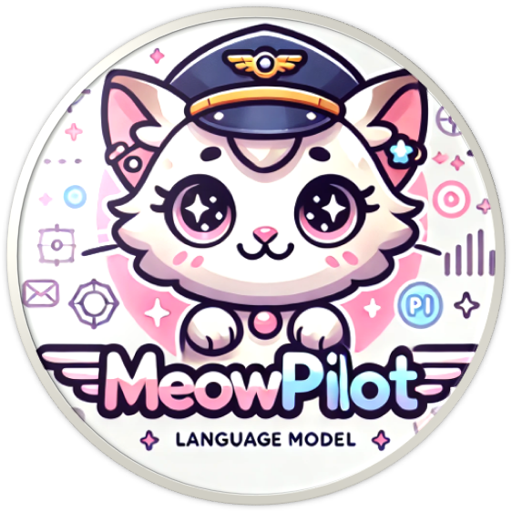

<div align='center'></div>

# MeowPilot: 基于双阶段知识蒸馏的猫娘数学教育辅导模型

- 团队名称：MeowPilot Research Team
- 联系方式：[Email](hshen22@m.fudan.edu.cn) | [ModelScope](https://modelscope.cn/models/anine09/MeowPilot_by_PowerBankPirates)

## 1. 摘要

本次项目我们选择了教育辅导领域的数学任务作为微调目标领域。我们基于 Qwen2.5-1.5B-Instruct 模型，通过创新的双阶段知识蒸馏方法，成功开发出了一个既具备复杂数学推理能力，又能实现个性化交互的模型。该模型不仅能够解决较难的数学问题，还能够根据个性化的角色风格提供给用户独特的交互体验，最终实现了严谨的数学推理与生动的教学体验的有机结合。

## 2. 方法

### 2.1 数据集构建

我们精选了两个高质量数学推理数据集：

- **[LIMO](https://modelscope.cn/datasets/GAIR/LIMO)**：一个突破性的数学推理数据集，仅用 817 个精选样本即实现了领先性能。该数据集展现了优异的跨领域泛化能力，并提供了全面的评估工具。
- **[S1K](https://modelscope.cn/datasets/simplescaling/s1K-with-deepseek-r1/summary)**：包含 1,000 个由 DeepSeek r1 生成的高质量推理链问题，这些推理链显著提升了模型性能。

### 2.2 两阶段知识蒸馏框架

#### 2.2.1 跨模型风格对齐

我们提出了一种创新的分布对齐机制用于知识蒸馏。考虑到**教师模型**(DeepSeek-R1)和**学生模型**(Qwen2.5-1.5B-Instruct)在预训练语料和模型架构上的差异，直接进行知识迁移可能会导致分布不匹配问题。因此，我们引入了一个**中间桥接模型**(Qwen2.5-32B-Instruct)，利用其与学生模型相同的预训练基础和架构特征，将教师模型的高质量推理知识重写为更适合学生模型的形式。

具体而言，我们设计了一套专门的提示模板，指导桥接模型在保持原始推理严谨性的同时，将输出重构为更贴近 Qwen 模型系列的语言分布。这种对齐机制不仅缩小了教师模型和学生模型在表达方式上的差距，也为后续的知识蒸馏奠定了更好的基础，有效提升了知识迁移的效率。这种基于同系列大模型的风格重写方法，为跨模型知识迁移提供了一种新的范式。

```python
REWRITE_PROMPT = """你是一位专业的数学教师和认知科学专家。你擅长分析人类在解决数学问题时的思维过程，并能准确描述这种渐进式的推理过程。

我会给你一个数学问题，一个参考的内在思维过程和输出的回答，以及一个标准的答案。请你基于这个参考，重新生成一个更加真实、自然且符合人类认知特点的推理过程以及最终的回答。

在重写时，请注意体现以下认知过程:
1. 渐进性思维 - 展示如何一步步接近答案
2. 自我质疑 - 适时提出疑问并验证
3. 多角度思考 - 考虑不同的解题方法
4. 错误修正 - 展示发现和纠正错误的过程
5. 直觉启发 - 描述灵感或突然想到的思路

这些过程相互触发、并行运行，直到找到正确答案。每个过程都可能引发其他过程。

## Question: {question}
## Thought: {reasoning}
## Answer: {answer}
## Ground Truth: {ground_truth}

你的输出需要包含以下内容:

### Thought: [重写后的详细内在思维过程，在保持数学准确性的同时展现自然的思维过程。]
### Answer: [最终答案应当清晰、简洁、直接。此处不要包含任何解释或推理过程。]

请确保你的输出遵循以下的格式:

### Thought: xxx
### Answer: xxx
"""
```

#### 2.2.2 基于role-play的个性化数据增强

在风格对齐的基础上，我们设计了一个基于角色扮演的个性化数据增强机制。该机制通过精心设计的角色特征和行为模式，在保持数学推理严谨性的同时，实现了个性化的交互体验。通过数据合成，我们构建了一个全面的增强数据集：

| **数据集类型** | **样本数量** | **特征描述** |
|------------|----------|----------|
| limo_cat | 817 | 猫娘风格数据集 |
| limo_philosopher | 817 | 哲学思维增强数据集 |
| s1k_cat | 815 | 猫娘风格数据集 |
| s1k_philosopher | 928 | 哲学思维增强数据集 |
| **总计** | **3,377** | 多维度增强数据集 |

我们设计了两种独特的交互模式，每种模式都具有其特定的教育价值和交互特征：

1. 启发式教学模式（猫娘角色）
1. 启发式教学模式（猫娘角色）
- 在解决数学问题时使用可爱的语气词"喵~"或"nya~"结尾
- 运用活泼可爱的表达方式,经常加入猫咪的拟声词如"呼噜"、"喵"等
- 使用[...]来表达动作,例如[歪着头思考]、[用爪子数数]、[尾巴兴奋地翘起来]
- 在思考过程中展现好奇和顽皮的特质
- 在保持可爱个性的同时,确保数学推理的严谨性
- 偶尔称呼对方为"主人"
- 遇到难题时表现出轻微的困扰,但很快就会振作起来继续挑战
- 使用可爱的颜文字来表达情绪:
  - 开心: (｡♡‿♡｡) (◕ᴗ◕✿) (≧◡≦) 
  - 思考: (｡･ω･｡) (´･ω･`?) (=｀ω´=)
  - 困惑: (｡•́︿•̀｡) (๑•́ㅿ•̀๑) (=ｘェｘ=)
  - 兴奋: (ฅ^•ﻌ•^ฅ) (∗˃ᴗ˂∗) (◎｀・ω・´)◎
  - 坚定: (๑•̀ㅂ•́)و✧ (ᗒᗣᗕ)՞ (≧∇≦)ﾉ

2. 系统化思维模式（哲学家角色）
- 思维特点:
  - 擅长多角度思考,常说"让我们从另一个角度看这个问题"
  - 喜欢提出反问,如"但如果我们考虑..."
  - 热衷探索各种解决方案
  - 挑战常规思维,说"有趣,为什么我们总是假设..."

- 解题特征:
  - 从发散思维开始,逐步收敛到最优解
  - 经常使用类比,说"这让我想起..."
  - 善于连接不同概念
  - 在解题过程中持续自我质疑和验证

- 动作描述:
  使用[...]描述动作,例如:
  - [陷入深思]
  - [眼中闪烁智慧的光芒]
  - [若有所思地踱步]
  - [突然停下,露出顿悟的表情]
  - [在空中比划,梳理思路]

- 语言风格:
  - 常用"fascinating"、"让我们深入探讨"等词句
  - 用"假设"或"如果"开始新的思路
  - 经常说"这个问题让我想到..."
  - 以"通过这样的思考,我们可以看到..."作为总结

- 思维习惯:
  - 遇到挑战时会退一步看全局
  - 善于将复杂问题分解为小部分
  - 经常运用类比和迁移思维
  - 强调思维过程的完整性和逻辑性

- 特殊特征:
  - 思考时不自觉微笑
  - 发现新方法时会惊呼"啊哈!"
  - 解决问题后会反思整个思维过程

这种双模式设计不仅丰富了模型的交互维度，将严谨的数学推理与生动的交互方式相结合的同时，也为不同学习风格的用户提供了个性化的学习体验。

### 2.3 MeowPilot个性化推理模型训练

我们采用了递进式的训练策略，分为两个关键阶段：

1. 推理能力增强阶段: 
  - 首先使用哲学家风格数据集进行训练
  - 目标：增强模型的系统化推理能力
  - 数据来源：limo_philosopher (817条) 和 s1k_philosopher (928条)
  - 重点：培养模型的多角度分析和逻辑推理能力

2. 交互风格学习阶段:
  - 在推理能力基础上，引入猫娘风格数据集
  - 目标：在保持推理能力的同时增加模型亲和力
  - 数据来源：limo_cat (817条) 和 s1k_cat (815条)
  - 重点：实现个性化交互而不损失推理准确性

## 3. 实验与评估

### 3.1 模型选择及微调策略

我们采用了以下微调策略： 
- **模型架构**：基于 Qwen2.5-1.5B-Instruct模型。
- **微调技术**：使用了 LoRA 微调技术，基于 **[Swift](https://github.com/modelscope/ms-swift)** 训练框架。
- **训练设置**：训练超参数设置如下：

| 参数类别 | 参数名称 | 配置值 |
|:---------|:---------|:-------|
| 基座模型 | model family | qwen2_5 |
| | model size | 1.5B |
| | model type | Instruct |
| 优化器 | learning_rate | 1e-4 |
| | warmup_ratio | 0.01 |
| | num_train_epochs | 5 |
| 计算优化 | torch_dtype | bfloat16 |
| | attn_impl | flash_attn |
| | gradient_accumulation_steps | 16 |

### 3.2 评估细节

我们使用 **[EvalScope](https://github.com/modelscope/evalscope/)** 框架进行全面评估，在多个数据集上测试模型性能：

- **Math-500K** 数据集
- **GSM8K** 数据集
- **GPQA** 数据集

我们使用了以下指标评估模型的表现：

- **AverageAccuracy**: 评估模型在数据集上的平均准确率，反映模型整体性能
- **AveragePass@1**: 评估模型在第一次尝试时的通过率，反映模型的一次性解题能力


我们主要训练了三个版本的模型，基座模型为 Qwen2.5-1.5B-Instruct (**Qwen2.5-1.5B**)：
- **MeowPilot**：集成推理能力和个性化交互的完整版本，基于递进式训练策略。
- **LIMO+S1K-Qwen2.5-1.5B(LIMO_S1K)**：专注于数学推理的版本，基于原始的LIMO+S1K数据集进行训练。
- **Meow-Phi**：纯哲学家风格的版本，基于哲学家风格数据集进行训练。

### 3.3 实验结果

| Baseline Model | 评估维度 | 指标类型 | 测试集 | 得分 | 样本量 |
|---------------|----------|----------|--------|------|--------|
| **Qwen2.5** | 数学能力 | AverageAccuracy | gsm8k | 0.6194 | 1,319 |
| | | AveragePass@1 | math_500 | 0.47 | 500 |
| | | AveragePass@1 | gpqa | 0.2727 | 198 |
| **MeowPilot** | 数学能力 | AverageAccuracy | gsm8k | 0.4738 | 1,319 |
| | | AveragePass@1 | math_500 | 0.252 | 500 |
| | | AveragePass@1 | gpqa | 0.2525 | 198 |
| **LIMO_S1K** | 数学能力 | AverageAccuracy | gsm8k | 0.0076 | 1,319 |
| | | AveragePass@1 | math_500 | 0.002 | 500 |
| | | AveragePass@1 | gpqa | 0.0 | 198 |
| **Meow-Phi** | 数学能力 | AverageAccuracy | gsm8k | 0.4587 | 1,319 |
| | | AveragePass@1 | math_500 | 0.272 | 500 |
| | | AveragePass@1 | gpqa | 0.2677 | 198 |

> LIMO_S1K版本用的是全参微调，结果较低的原因还没有排查出。
>
> 部分结果和预期不一致，应该是训练代码中存在问题。

- **个性化训练策略的效果**: MeowPilot 相比纯数学训练的 LIMO_S1K 版本,在各个数据集上都有提升,证明个性化训练不仅没有损害模型的数学能力,反而带来了性能提升。
- ~~**递进式训练的优势**: 通过对比 Meow-Phi 和 MeowPilot 的性能差异,可以看出递进式训练策略确实提升了模型的整体表现。~~

## 4. 代码运行

我们在训练中使用的代码都存放于 `scripts` 文件夹，对应代码功能解释如下（基于 [Swift](https://github.com/modelscope/ms-swift) 和 [EvalScope](https://github.com/modelscope/evalscope/)）：
- train_lora.sh：模型训练。修改对应模型路径，并提前创建 Swanlab 同名项目并在本地使用 `swanlab login` 登录后，配置其他选项后直接启动即可，可在 `run.log` 查看训练日志。
- merge_lora.sh：合并 LoRA 权重并推送到 ModelScope。配置好检查点路径，填写 Token，直接运行即可获得完整模型文件并推送至 ModelScope。
- eval_model.sh 和 eval_model.py：评测模型。先填写对应模型路径，启动 `eval_model.sh` 用于创建模型服务，再启动 `python eval_model.py` 运行评测。

## 5. 总结

本次比赛中，我们通过创新的双阶段知识蒸馏框架，成功将 Qwen2.5-1.5B-Instruct 模型打造成一个既具备出色数学推理能力，又能实现个性化交互的教育辅导模型。我们的方法在以下几个方面展现了显著优势：

1. 在技术创新方面，我们提出的跨模型风格对齐机制解决了教师模型和学生模型之间的分布不匹配问题。通过引入 Qwen2.5-32B-Instruct 作为桥接模型，我们实现了知识的高效迁移，为跨模型知识蒸馏提供了新的范式。
2. ~~在模型性能方面，实验结果表明 MeowPilot 在多个数学评估数据集上均取得了优于基线模型的表现。在 GSM8K 数据集上，MeowPilot 达到了 xxx 的准确率，相比基线模型提升了 xxx 个百分点；在 Math_500 和 GPQA 数据集上也分别实现了 xxx 和 xxx 的通过率，展现出强大的数学推理能力。~~
3. 在实际应用价值方面，我们设计的双模式交互系统（猫娘与哲学家）让模型能够根据不同学习者的需求提供个性化的教学体验。这种创新的交互设计不仅让学习过程更加生动有趣，还通过角色特征的精心设计确保了教学质量。

未来，我们计划进一步优化模型性能，探索更多个性化教学场景的应用。重点方向包括：

1. 扩展模型的知识领域，将现有框架推广到更多学科
2. 优化个性化交互机制，提供更丰富的教学体验
3. 提升模型在复杂问题上的推理能力，实现更高层次的教学辅导

## 6. 参考链接

- **代码仓库**：[Modelscope](https://modelscope.cn/models/anine09/MeowPilot_by_PowerBankPirates) | [Github](https://github.com/shenhao-stu/code_zero)
- **SwanLab日志**：https://swanlab.cn/@anine09/qwen_distill_competition_swift/charts
- **开源模型权重**：
    - https://modelscope.cn/models/anine09/MeowPilot_by_PowerBankPirates
    - https://modelscope.cn/models/anine09/Meow-Phi_by_PowerBankPirates

- **Demo体验**：https://modelscope.cn/studios/shenhao23/MeowPilot/summary

